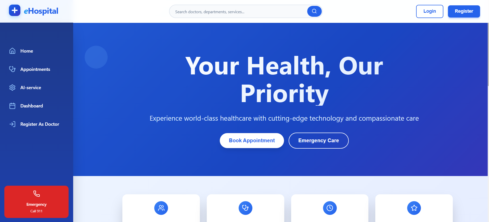
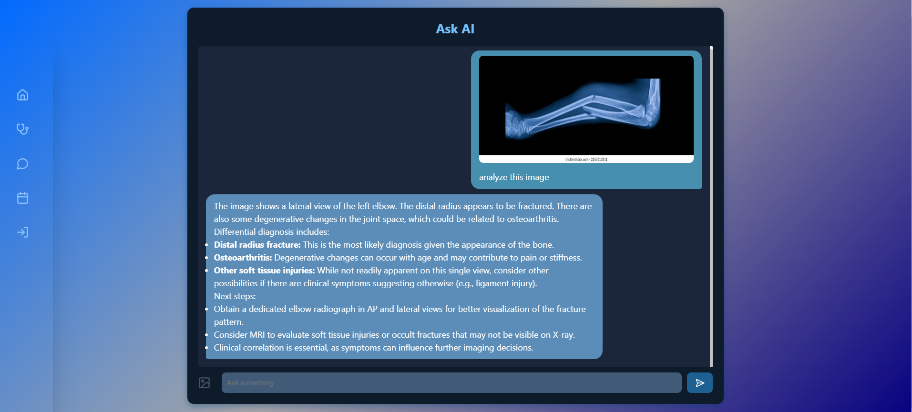

# eHospital - Smart Healthcare Management System

  <!-- Replace with your banner image -->

---

## 🚑 Project Overview

eHospital is a comprehensive healthcare management system designed to streamline hospital operations and enhance patient care. It leverages cutting-edge technologies including Django, React, and the latest AI models for medical image analysis.

---

## 🛠️ Technology Stack

- **Backend:** Django + Django REST Framework  
- **Frontend:** React.js  
- **AI Integration:** LM Studio with MedGemma (a Google-launched local LLM)  
- **Authentication:** Secure token-based authentication (JWT)  
- **Features:**  
  - Appointment booking and management  
  - Strong user authentication & authorization  
  - AI-powered medical image and X-ray analysis using MedGemma  
  - RESTful APIs for smooth frontend-backend interaction  

---

## 🧠 About MedGemma

MedGemma is a powerful local large language model specialized in medical data. It supports both **image** and **text** inputs and has been trained to interpret medical images, such as X-rays, enabling smart diagnostics directly integrated into the platform.

  <!-- Replace with your MedGemma demo image -->

---

## 📸 Screenshots

### User Dashboard


### Appointment Scheduling


### AI-powered Image Analysis


---

## 🚀 Features

- **User Registration & Login** with JWT authentication  
- **Appointment Handling** for patients and doctors  
- **AI-powered Medical Image Analysis** using MedGemma to provide instant insights from X-rays  
- **RESTful APIs** built with Django REST Framework for modular and scalable architecture  
- Responsive and modern **React frontend** UI

---

## ⚙️ Getting Started

### Prerequisites

- Python 3.8+  
- Node.js & npm  
- LM Studio installed locally for running MedGemma  

### Installation

1. Clone the repository  
   ```bash
   git clone https://github.com/YourUsername/eHospital.git
   cd eHospital
